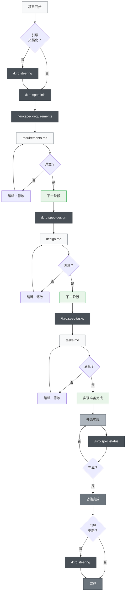
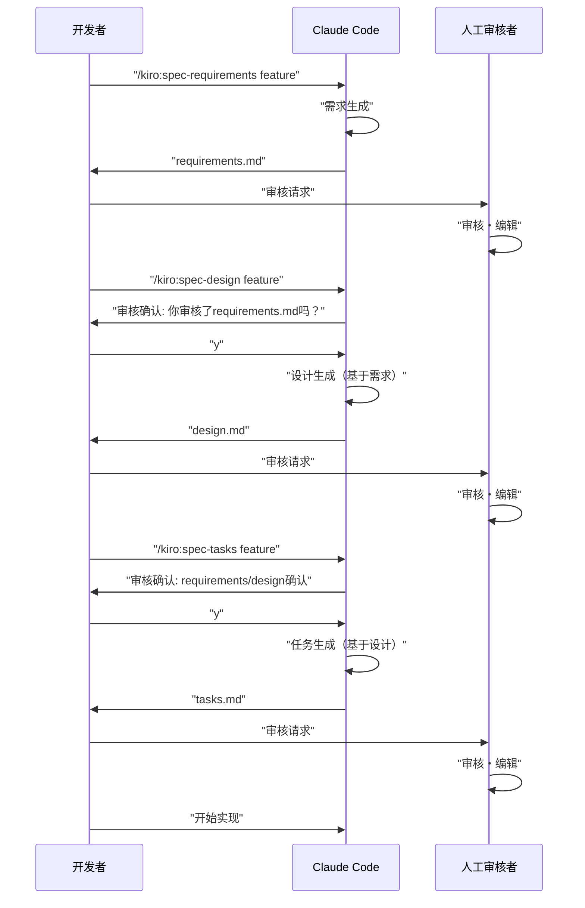

# Claude Code 规格驱动开发

> 🌐 **语言**  
> 📖 **简体中文说明**（本页）| 📖 **[English Version](README_en.md)** | 📖 **[日本語版 README](README_ja.md)** | 📖 **[繁体中文说明](README_zh-TW.md)**

> [!警告]
> 这是初始版本，将随着使用逐步改进

📝 **相关文章**  
**[Kiro的规格驱动开发过程在Claude Code中的完整重现](https://zenn.dev/gotalab/articles/3db0621ce3d6d2)** - Zenn文章

使用Claude Code的Slash Commands和CLAUDE.md来实践规格驱动开发（Spec-Driven Development）的项目，采用与Kiro IDE相同的目录结构。该项目几乎完全重现了Kiro的实际规格驱动开发流程，包括目录结构。

## 概述

这个项目提供了使用Claude Code的Slash Commands来高效进行规格驱动开发（Spec-Driven Development）的工具集。通过在各个开发阶段使用合适的命令，可以实现系统化和高质量的开发过程。

## 设置

### 🎯 推荐方式：使用Kiro Spec VS Code扩展（一键安装）

我们提供了专门的VS Code扩展来自动化安装和配置过程：

#### 安装Kiro Spec扩展

1. **下载VSIX文件**：
   - 访问 [GitHub Releases页面](https://github.com/kiro-code/kiro-spec/releases)
   - 下载最新的 `kiro-spec-x.x.x.vsix` 文件

2. **安装扩展**：
   - 在VS Code中按 `Ctrl+Shift+P` (Windows/Linux) 或 `Cmd+Shift+P` (macOS)
   - 输入 `Extensions: Install from VSIX...`
   - 选择下载的VSIX文件

3. **一键初始化项目**：
   - 打开您的项目目录
   - 按 `Ctrl+Shift+P` 打开命令面板
   - 输入 `Kiro Spec: 初始化项目`
   - 选择语言版本（中文/英文/日文/繁体中文）
   - 完成！所有必需文件已自动安装

#### 扩展功能
- ✅ **自动安装** - 一键安装所有`.claude/commands`和`CLAUDE.md`文件
- ✅ **多语言支持** - 支持中文、英文、日文、繁体中文四种语言
- ✅ **智能检测** - 自动检测安装状态，避免重复安装
- ✅ **状态检查** - 随时查看配置完整性
- ✅ **强制重装** - 可覆盖现有配置更新到最新版本

### 手动集成到项目（传统方式）

如果您不使用VS Code扩展，也可以手动集成：

1. **复制文件**：
   - `.claude/commands/` 目录 - Slash Commands的定义
   - `CLAUDE.md` 文件 - Claude Code的设置和项目指示

2. **调整配置**：复制CLAUDE.md并根据项目进行调整

3. **执行初始命令**：
   ```bash
   # 可选：创建引导文档
   /kiro:steering
   
   # 创建第一个功能规格
   /kiro:spec-init "你的项目的详细说明"
   ```

### 所需目录结构

执行命令后，将自动创建以下目录：

```
你的项目/
├── .claude/
│   └── commands/          # 复制的命令定义
├── .kiro/
│   ├── steering/          # 自动生成的引导文档
│   └── specs/             # 自动生成的功能规格
├── CLAUDE.md              # 从语言特定文件（如：CLAUDE_en.md, CLAUDE_zh-TW.md）复制并重命名
├── CLAUDE_en.md           # 英语版Claude Code设置
├── CLAUDE_zh-TW.md        # 繁体中文版Claude Code设置
├── CLAUDE_zh-CN.md        # 简体中文版Claude Code设置
├── README.md              # 简体中文版README
├── README_en.md           # 英语版README
├── README_ja.md           # 日语版README
├── README_zh-TW.md        # 繁体中文版README
└── （你的项目文件）
```

## 使用方法

### 1. 新项目的情况

```bash
# 可选：生成项目引导（推荐但非必需）
/kiro:steering

# 步骤1：开始创建新功能规格（包含详细说明）
/kiro:spec-init "用户上传PDF，提取其中的图表，AI解释内容的功能。技术栈使用Next.js、TypeScript、Tailwind CSS。"

# 步骤2：需求定义（使用自动生成的feature-name）
/kiro:spec-requirements pdf-diagram-extractor
# → 审核・编辑 .kiro/specs/pdf-diagram-extractor/requirements.md

# 步骤3：技术设计（交互式批准）
/kiro:spec-design pdf-diagram-extractor
# → 回答 "你已经审核了requirements.md吗？ [y/N]"
# → 审核・编辑 .kiro/specs/pdf-diagram-extractor/design.md

# 步骤4：任务生成（交互式批准）
/kiro:spec-tasks pdf-diagram-extractor
# → 回答 requirements 和 design 的审核确认
# → 审核・编辑 .kiro/specs/pdf-diagram-extractor/tasks.md

# 步骤5：开始实现
```

### 2. 向现有项目添加功能

```bash
# 可选：创建・更新引导
# 新创建和更新都使用同一个命令
/kiro:steering

# 步骤1：开始创建新功能规格
/kiro:spec-init "在这里详细描述新功能"
# 之后与新项目相同
```

### 3. 进度确认

```bash
# 确认特定功能的进度
/kiro:spec-status my-feature

# 显示当前阶段、批准状况、任务进度
```

## 规格驱动开发过程

### 过程流程图

在这个流程中，每个阶段都需要"审核・批准"。

**引导文档**是记录项目永久知识（架构、技术栈、代码约定等）的文档。创建・更新是可选的，但推荐使用以提高项目的长期可维护性。



## Slash命令一览

### 🚀 阶段0：项目引导（可选）

| 命令 | 用途 | 使用时机 |
|---------|------|---------------|
| `/kiro:steering` | 引导文档的智能创建・更新 | 所有场面（新建・更新都可以） |
| `/kiro:steering-custom` | 自定义引导文档的创建 | 需要特殊约定或指导原则时 |

**注意**：引导文档是推荐的但非必需的。小规模功能追加或试验性开发可以省略。

#### 引导文档的种类
- **product.md**：产品概述、功能、用例
- **tech.md**：架构、技术栈、开发环境
- **structure.md**：目录结构、代码约定、命名规则
- **自定义文档**：API约定、测试方针、安全策略等

### 📋 阶段1：规格创建

| 命令 | 用途 | 使用时机 |
|---------|------|---------------|
| `/kiro:spec-init [详细的项目说明]` | 从项目说明初始化规格结构 | 新功能开发开始时 |
| `/kiro:spec-requirements [feature-name]` | 需求定义书的生成 | 规格初始化后立即 |
| `/kiro:spec-design [feature-name]` | 技术设计书的生成 | 需求批准后 |
| `/kiro:spec-tasks [feature-name]` | 实现任务的生成 | 设计批准后 |

### 📊 阶段2：进度管理

| 命令 | 用途 | 使用时机 |
|---------|------|---------------|
| `/kiro:spec-status [feature-name]` | 当前进度和阶段确认 | 开发中随时 |

## 3阶段批准工作流

该系统的核心是在每个阶段都必须进行人工审核和批准



## 最佳实践

### ✅ 推荐事项

1. **始终从引导开始**
   - 在所有场面使用 `/kiro:steering`（智能判断新建・更新）
   - 统合命令在保护现有文件的同时适当处理

2. **不要跳过阶段**
   - 严格遵守 需求 → 设计 → 任务 的顺序
   - 每个阶段必须进行人工审核

3. **定期进度确认**
   - 用 `/kiro:spec-status` 了解当前状况
   - 适当更新任务完成状况

4. **引导的维护**
   - 大的变更后执行 `/kiro:steering`（自动判断更新）
   - 配合项目的成长进行更新

### ❌ 应该避免的

1. **未经批准就进入下一阶段**
   - 不要忘记对提示的确认回应

2. **放置引导文档**
   - 旧信息会妨碍开发

3. **未更新任务状态**
   - 进度不明确，管理变得困难

## 项目结构

```
.
├── .claude/
│   └── commands/          # Slash命令定义
│       └── kiro/
│           ├── spec-init.md
│           ├── spec-requirements.md
│           ├── spec-design.md
│           ├── spec-tasks.md
│           ├── spec-status.md
│           ├── steering.md          # 统合引导命令
│           └── steering-custom.md
├── .kiro/
│   ├── steering/          # 引导文档
│   │   ├── product.md
│   │   ├── tech.md
│   │   └── structure.md
│   └── specs/             # 功能规格
│       └── [feature-name]/
│           ├── spec.json      # 阶段批准状态
│           ├── requirements.md # 需求定义书
│           ├── design.md      # 技术设计书
│           └── tasks.md       # 实现任务
├── CLAUDE.md              # 主设置（从下述某个语言文件复制）
├── CLAUDE_en.md           # 英语版设置
├── CLAUDE_ja.md           # 日语版设置
├── CLAUDE_zh-TW.md        # 繁体中文版设置
├── CLAUDE_zh-CN.md        # 简体中文版设置
├── README.md              # 简体中文版README
├── README_en.md           # 英语版README
├── README_ja.md           # 日语版README
├── README_zh-TW.md        # 繁体中文版README
└── （你的项目文件）
```

## 自动化功能

通过Claude Code的钩子功能实现了以下自动化：

- 任务进度的自动跟踪
- 规格遵守检查
- 紧凑时的上下文保持
- 引导漂移检测

## 故障排除

### 命令不工作的情况
1. 确认 `.claude/commands/` 目录的存在
2. 确认命令文件的命名规则（`command-name.md`）
3. 确认是否使用Claude Code的最新版本

### 在批准流程中卡住的情况
1. 确认是否正确回应了审核确认提示
2. 确认前阶段的批准是否完成
3. 用 `/kiro:spec-status` 诊断当前状态
4. 必要时手动确认・编辑 `spec.json`

## 总结

通过活用Claude Code的Slash命令进行规格驱动开发，可以实现以下目标：

- 📐 系统化的开发过程
- ✅ 为质量保证而进行的阶段性批准
- 📊 高透明度的进度管理
- 🔄 持续的文档更新
- 🤖 AI辅助带来的效率化

使用该系统可以大幅提升开发的质量和效率。