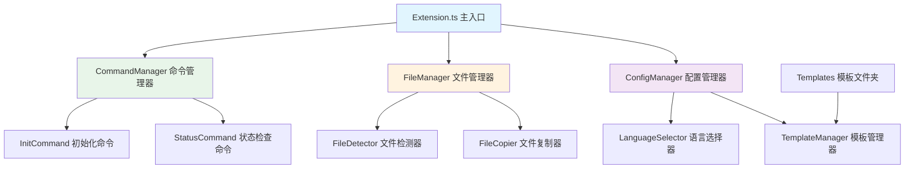
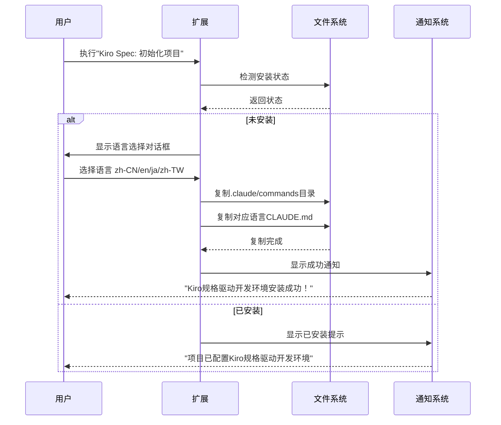
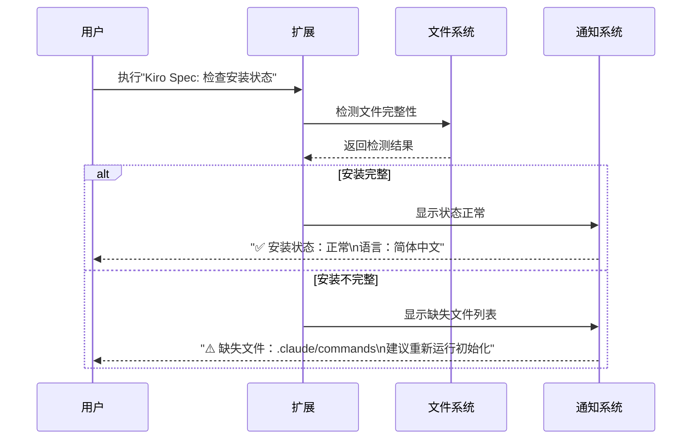

# Kiro Spec VS Code扩展技术规格文档

## 1. 项目概述

### 1.1 项目名称
**kiro-spec** - Kiro规格驱动开发自动化安装扩展

### 1.2 项目目标
为Claude Code规格驱动开发项目提供一键式自动化安装和配置功能，消除手动复制文件的繁琐过程。

### 1.3 目标用户
- 使用Claude Code进行规格驱动开发的开发者
- 需要快速配置项目环境的团队
- 混合技能水平的用户群体

## 2. 功能需求

### 2.1 核心功能
1. **项目初始化** - 一键安装所有必要文件
2. **安装状态检查** - 验证安装是否正确
3. **多语言支持** - 支持简体中文/英文/日文/繁体中文
4. **智能检测** - 避免重复安装
5. **可以强制覆盖安装** 

### 2.2 命令规格
| 命令名称 | 功能描述 | 执行条件 |
|---------|----------|----------|
| `Kiro Spec: 初始化项目` | 复制.claude/commands目录和CLAUDE.md文件 | 工作区已打开 |
| `Kiro Spec: 强制重新安装` | 强制覆盖现有文件重新安装 | 工作区已打开 |
| `Kiro Spec: 检查安装状态` | 验证必要文件是否存在和配置是否正确 | 工作区已打开 |

## 3. 技术架构

### 3.1 技术栈
- **开发语言**: TypeScript
- **框架**: VS Code Extension API
- **构建工具**: webpack
- **包管理**: npm
- **测试框架**: Mocha + Chai

### 3.2 架构设计



### 3.3 模块设计

#### 3.3.1 核心模块

**Extension.ts** - 扩展主入口
```typescript
interface ExtensionContext {
  commands: CommandManager;
  fileManager: FileManager;
  configManager: ConfigManager;
}
```

**CommandManager** - 命令管理器
```typescript
interface ICommandManager {
  registerCommands(): void;
  executeInit(): Promise<void>;
  executeStatusCheck(): Promise<StatusResult>;
}
```

**FileManager** - 文件管理器
```typescript
interface IFileManager {
  detectInstallation(): Promise<InstallationStatus>;
  copyClaudeCommands(): Promise<void>;
  copyClaudeConfig(language: SupportedLanguage): Promise<void>;
}
```

**ConfigManager** - 配置管理器
```typescript
interface IConfigManager {
  selectLanguage(): Promise<SupportedLanguage>;
  getTemplates(): TemplateSet;
  validateConfiguration(): Promise<ValidationResult>;
}
```

## 4. 文件结构

```
kiro-spec/
├── package.json              # 扩展配置文件
├── tsconfig.json             # TypeScript配置
├── webpack.config.js         # 构建配置
├── src/                      # 源代码目录
│   ├── extension.ts          # 主入口文件
│   ├── commands/             # 命令实现
│   │   ├── init-command.ts
│   │   └── status-command.ts
│   ├── managers/             # 管理器模块
│   │   ├── command-manager.ts
│   │   ├── file-manager.ts
│   │   └── config-manager.ts
│   ├── utils/                # 工具函数
│   │   ├── file-detector.ts
│   │   ├── file-copier.ts
│   │   └── notifications.ts
│   └── types/                # 类型定义
│       └── index.ts
├── templates/                # 内置模板文件
│   ├── claude-commands/      # .claude/commands目录模板
│   │   └── kiro/
│   │       ├── spec-init.md
│   │       ├── spec-requirements.md
│   │       ├── spec-design.md
│   │       ├── spec-tasks.md
│   │       ├── spec-status.md
│   │       ├── steering.md
│   │       └── steering-custom.md
│   └── claude-configs/       # CLAUDE.md模板文件
│       ├── CLAUDE_zh-CN.md
│       ├── CLAUDE_en.md
│       ├── CLAUDE_ja.md
│       └── CLAUDE_zh-TW.md
├── test/                     # 测试文件
│   ├── suite/
│   │   ├── extension.test.ts
│   │   ├── file-manager.test.ts
│   │   └── config-manager.test.ts
│   └── runTest.ts
├── .vscodeignore            # VS Code打包忽略文件
└── README.md                # 用户文档
```

## 5. 数据结构

### 5.1 类型定义

```typescript
// 支持的语言类型
type SupportedLanguage = 'zh-CN' | 'en' | 'ja' | 'zh-TW';

// 安装状态
interface InstallationStatus {
  claudeCommands: boolean;
  claudeConfig: boolean;
  language?: SupportedLanguage;
}

// 状态检查结果
interface StatusResult {
  isInstalled: boolean;
  missingFiles: string[];
  currentLanguage?: SupportedLanguage;
  recommendations: string[];
}

// 验证结果
interface ValidationResult {
  isValid: boolean;
  errors: string[];
  warnings: string[];
}

// 模板集合
interface TemplateSet {
  commands: CommandTemplate[];
  configs: ConfigTemplate[];
}
```

## 6. 核心算法

### 6.1 安装检测算法

```typescript
async function detectInstallation(): Promise<InstallationStatus> {
  const workspaceRoot = vscode.workspace.workspaceFolders?.[0]?.uri.fsPath;
  if (!workspaceRoot) throw new Error('未打开工作区');

  const claudeCommandsPath = path.join(workspaceRoot, '.claude', 'commands');
  const claudeConfigPath = path.join(workspaceRoot, 'CLAUDE.md');

  const status: InstallationStatus = {
    claudeCommands: await fs.pathExists(claudeCommandsPath),
    claudeConfig: await fs.pathExists(claudeConfigPath)
  };

  if (status.claudeConfig) {
    status.language = await detectConfigLanguage(claudeConfigPath);
  }

  return status;
}
```

### 6.2 文件复制算法

```typescript
async function copyTemplate(source: string, destination: string): Promise<void> {
  await fs.ensureDir(path.dirname(destination));
  await fs.copy(source, destination, {
    overwrite: false,
    errorOnExist: false,
    filter: (src) => !path.basename(src).startsWith('.')
  });
}
```

## 7. 用户交互流程

### 7.1 初始化流程



### 7.2 状态检查流程



## 8. 错误处理

### 8.1 错误类型

```typescript
enum ErrorType {
  WORKSPACE_NOT_FOUND = 'WORKSPACE_NOT_FOUND',
  FILE_PERMISSION_DENIED = 'FILE_PERMISSION_DENIED',
  TEMPLATE_NOT_FOUND = 'TEMPLATE_NOT_FOUND',
  COPY_FAILED = 'COPY_FAILED'
}

interface ExtensionError {
  type: ErrorType;
  message: string;
  details?: any;
  recovery?: string;
}
```

### 8.2 错误恢复策略

- **工作区未打开**: 提示用户先打开项目文件夹
- **文件权限拒绝**: 提示用户检查文件权限或以管理员身份运行
- **模板文件缺失**: 重新安装扩展或报告bug
- **复制失败**: 检查磁盘空间，重试操作

## 9. 性能要求

### 9.1 响应时间
- 命令执行响应时间 < 200ms
- 文件复制完成时间 < 2s
- 状态检查完成时间 < 100ms

### 9.2 资源占用
- 内存占用 < 50MB
- 扩展大小 < 5MB
- 启动时间 < 1s

## 10. 测试策略

### 10.1 单元测试
- 文件检测功能测试
- 文件复制功能测试  
- 语言配置功能测试
- 错误处理测试

### 10.2 集成测试
- 完整初始化流程测试
- 多语言切换测试
- 重复安装测试

### 10.3 用户验收测试
- 新用户首次使用场景
- 现有用户升级场景
- 不同操作系统兼容性测试

## 11. 部署和发布

### 11.1 构建流程
1. `npm run compile` - TypeScript编译
2. `npm run test` - 运行测试套件
3. `vsce package` - 打包扩展
4. `vsce publish` - 发布到市场

### 11.2 版本管理
- 遵循语义化版本控制
- 主版本号：重大架构变更
- 次版本号：新功能添加
- 修订版本号：bug修复

### 11.3 发布清单
- [ ] 功能完整性测试
- [ ] 多平台兼容性验证  
- [ ] 用户文档更新
- [ ] 变更日志编写
- [ ] 扩展市场信息更新

## 12. 维护和支持

### 12.1 监控指标
- 扩展安装数量
- 命令执行成功率
- 用户反馈评分
- 错误报告统计

### 12.2 更新计划
- 月度bugfix版本
- 季度功能更新
- 年度架构优化

---

**文档版本**: 1.0.0  
**最后更新**: 2025年8月2日  
**文档作者**: Kilo Code